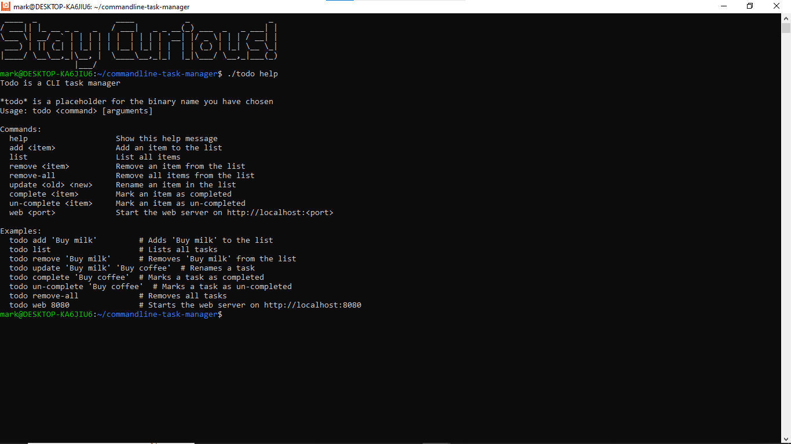
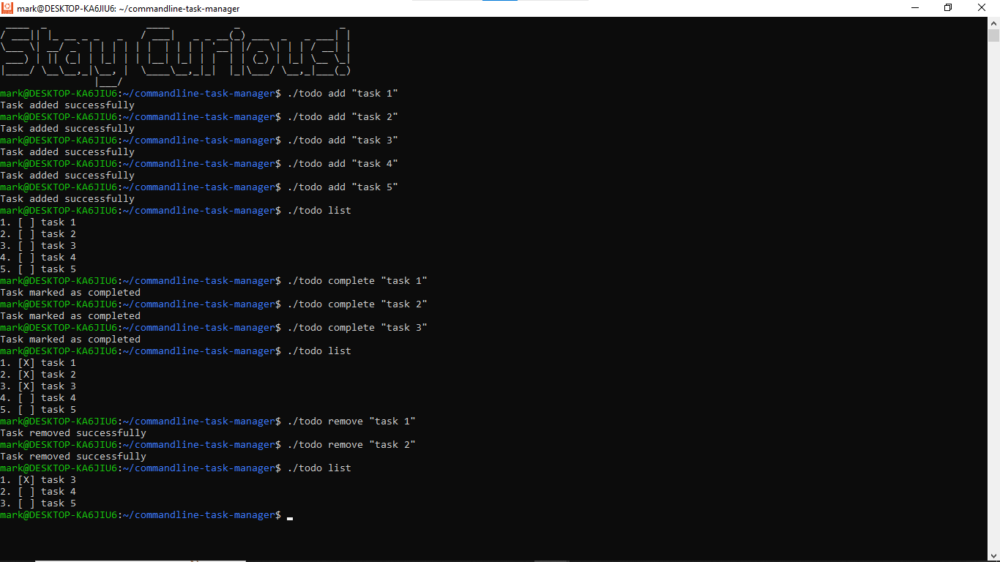
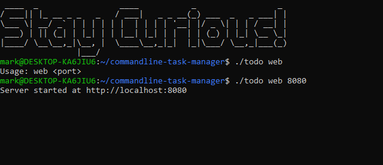
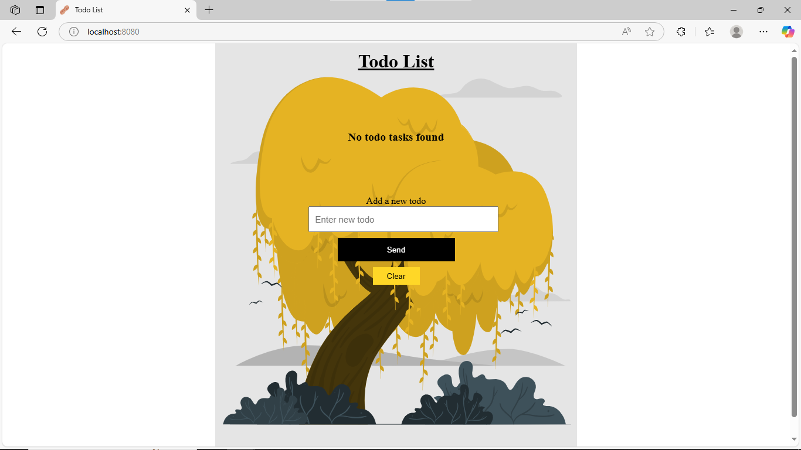
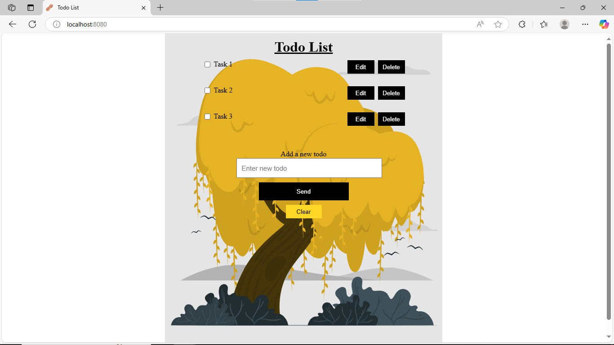

# commandline-task-manager
Simple task manager for the commandline
It is a simple task manager for the commandline. It allows you to add, remove, list todo tasks.
It persists the tasks in a file so that you can access them later.
It has a web feature to run a localhost server with a **single page app written in vanilla js** for a better user experience.

## Installation
1. Run the following command to clone the repository.
``` shell
https/github.com/opaque-maniac/commandline-task-manager.git
```

2. Run the following command to install the dependencies.
``` shell
go build -o <executable_name>
```

3. Run the following command to run the application.
``` shell
<executable_name> help
```

## Usage
1. To get help, run the following command.
``` shell
<executable_name> help
```

2. To add a task, run the following command.
``` shell
<executable_name> add <task>
```

3. To list all the tasks, run the following command.
``` shell
<executable_name> list
```
4. To update a task, run the following command.
``` shell
<executable_name> update <task_name> <new_task_name>
```

5. To mark a task as completed, run the following command.
``` shell
<executable_name> complete <task_name>
```

6. To remove a task, run the following command.
``` shell
<executable_name> remove <task_name>
```

7. To remove all the tasks, run the following command.
``` shell
<executable_name> remove-all
```

## Project structure
- This is the project structure wth main.go being the entry point.
- The directory **logic** contains most of the todo storage logic.
- The directory **web** contains logic for the web server for the web interface.
- The directory **static** contains static assets for the web interface (css, js, images).

```
├── README.md
├── go.mod
├── logic
│   ├── data-struct.go
│   ├── file.go
│   ├── file_test.go
│   └── help.go
├── main.go
├── static
│   ├── images
│   │   └── one.svg
│   ├── javascript
│   │   ├── app.js
│   │   ├── components
│   │   │   ├── 404Page.js
│   │   │   ├── EditPage.js
│   │   │   ├── HomePage.js
│   │   │   ├── Mutations.js
│   │   │   ├── Queries.js
│   │   │   └── TodoItem.js
│   │   └── services
│   │       └── Router.js
│   └── stylesheets
│       ├── 404Page.css
│       ├── EditPage.css
│       ├── HomePage.css
│       └── styles.css
├── templates
│   └── index.html
├── todo
├── todo-data.json
└── web
    ├── server.go
    └── types.go
```

## Screens
Here are some of the screenshots from the tool.






### Conclusion
This app provided a way to practice golang so it was fun and I got to build a single page app in vanilla js which was new.
